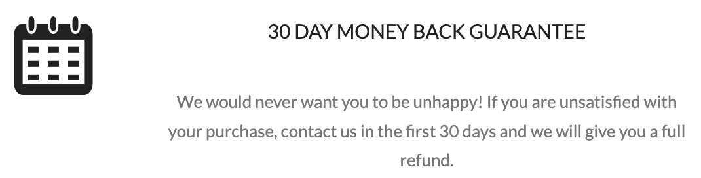

# QA Automation Engineer Challenge

Thanks for your interest in joining RevHouse. At this stage, we ask you to solve the following
challenge. Best of luck!

For this challenge you can use any language that you're comfortable with.

## Test Components

The test script should execute the following tasks:
1. Go to https://rahulshettyacademy.com/AutomationPractice/
2. In the Suggestion Class Example, enter the word “Ar” and select Argentina.
(Bonus: use only xpath)
3. In the Dropdown Example, select option 2 and then option 3. The user should be able to
see the change
(Bonus: use only xpath without using ids, text or values)
4. In the Switch Window Example, click the Open Window button. If the 30 day money back
guarantee text (example below) is not shown, fail the test. Close the new window.

5. In the iFrame example, get the text highlighted in blue in the following image and print it.

## Delivery and code requirements

- Add A README in the root of your code with clear instructions on how to compile (if
needed) and run your code.
- Upload your code to your github in a repo called “RevHouse-QA-Automation-Challenge” 

## Bonus

- Use POM (Page Object Model) 
- Use Gherkin
